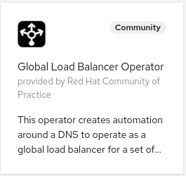

# Global Load Balancer Operator


[](https://goreportcard.com/report/github.com/redhat-cop/global-load-balancer-operator)


The global-load-balancer-operator implements automation to program a DNS service to act as global load balancer for applications deployed to multiple OpenShift clusters.
This operator is designed to be deployed to a control cluster which will watch the load balanced clusters (controlled clusters).
There are two main concepts (APIs) provided by this operator:

1. GlobalDNSZone
2. GlobalDNSRecord

## GlobalDNSZone

The `GlobalDNSZone` CR allows you to configure a zone which will contain global load balanced records and the provider used to populate it.
Here is an example of GlobalDNSZone:

```yaml
apiVersion: redhatcop.redhat.io/v1alpha1
kind: GlobalDNSZone
metadata:
  name: external-dns-zone
spec:
  # Add fields here
  domain: global.myzone.io
  provider:
    externalDNS:
      annotations:
        type: global
```

Here is a table summarizing the supported providers and their capabilities:

| Provider  | Supports Health Checks  | Supports Multivalue LB | Supports Latency LB  | Supports GeoProximity LB  |
|:--:|:--:|:---:|:---:|:---:|
| External-dns  | no  | yes | no  | no  |
| Route53  | yes | yes(*)  | yes(*)  | yes(*)  |

(*) only if all controlled clusters run on AWS.

## GlobalDNSRecord

The `GlobalDNSRecord` CR allows you to specify the intention to create a global dns record. Here is an example

```yaml
apiVersion: redhatcop.redhat.io/v1alpha1
kind: GlobalDNSRecord
metadata:
  name: hello-global-record
spec:
  name: hello.global.myzone.io
  endpoints:
  - clusterName: cluster1
    clusterCredentialRef:
      name: kubeconfig
      namespace: cluster1
    loadBalancerServiceRef:
      name: router-default
      namespace: openshift-ingress
  - clusterName: cluster2
    clusterCredentialRef:
      name: kubeconfig
      namespace: cluster2
    loadBalancerServiceRef:
      name: router-default
      namespace: openshift-ingress
  - clusterName: cluster3
    clusterCredentialRef:
      name: kubeconfig
      namespace: cluster3
    loadBalancerServiceRef:
      name: router-default
      namespace: openshift-ingress
  ttl: 60
  loadBalancingPolicy: Multivalue
  globalZoneRef:
    name: external-dns-zone
  healthCheck:
    failureThreshold: 3
    httpGet:
      host: hello.global.myzone.io
      httpHeaders:
        - name: ciao
          value: hello
      path: /readyz
      port: 80
      scheme: HTTP
    periodSeconds: 10
    successThreshold: 1
    timeoutSeconds: 1
```

The list of endpoints identifies the set of `LoadBalancer` type of services to watch on the remote clusters (at the moment only LoadBalancer services are supported). These are the `LoadBalancer` services created by the [ingress controller](https://docs.openshift.com/container-platform/4.5/networking/ingress-operator.html) on which the routers rely. Each entry of this list requires a reference to the loadbalancer service on the remote cluster and a reference to a local secret containing the credential to connect to the remote cluster.

This secret must contain one entry called `kubeconfig` with a kubeconfig file with a default context pointing to the remote cluster. The account used by the kubeconfig file (presumably a service account) will require at a minimum cluster-level permissions as described in this [cluster role](./docs/scripts/remote-account-cluster-role.yaml).

The `globalZoneRef` field refers to a local (same namespace) `GlobalZone` CR. The DNS record represented by this `GlobalDNSRecord`, will be created in the referenced zone.

`ttl` is the TTL of the crated DNS record.

`loadBalancingPolicy` is the load balancing policy for this global record. It must match one of the policy supported by the provider of the referenced `GlobalZone`.

Finally, `healthcheck` represent a [probe](https://kubernetes.io/docs/reference/generated/kubernetes-api/v1.18/#probe-v1-core) to be used to test the health of a record. This field will be ignored if the provider does not support health checks.

## External DNS Provider

The [external-dns](https://github.com/kubernetes-sigs/external-dns) provider delegates to external-dns the creation of the actual DNS records by creating a `DNSEndpoint` object.
The `DNSEndpoint` object will be created in the same namespace as the `GlobalDNSRecord` and will be owned by it.
The `DNSEdnpoint` object will have the same labels as the `GlobalDNSRecord` and the annotations specified in the GlobalDNSZone configuration.
External-dns should be configured to watch for DNSEnpoints at the cluster level and to point to the desired provider.
Details on configuration can be found at the external-dns git repository.
The External-dns should be used as a fall back option when other options are not available as it does not support health checks and advanced load balancing policies.

## AWS Route53 provider

AWS Route53 provider uses the Route53 service as a global loadbalancer and offers advanced routing capabilities via [route53 traffic policies](https://docs.aws.amazon.com/Route53/latest/DeveloperGuide/traffic-flow.html) (note that traffic policies will trigger an expense).
The following routing polices are currently supported:

1. [Multivalue](https://docs.aws.amazon.com/Route53/latest/DeveloperGuide/routing-policy.html#routing-policy-multivalue)
2. [Geoproximity](https://docs.aws.amazon.com/Route53/latest/DeveloperGuide/routing-policy.html#routing-policy-geoproximity)
3. [Latency](https://docs.aws.amazon.com/Route53/latest/DeveloperGuide/routing-policy.html#routing-policy-latency)

AWS Route53 provider at the moment requires that all the controlled clusters run in AWS.

If health checks are defined, a route53 health check originating from any reason (you have to ensure connectivity) will be created for each of the endpoint. Because the endpoint represent s a shared ELB (shared with other apps, that is) and the health check is app specific, we cannot use the ELB health check, so the route53 endpoint is created with one of the two IP exposed by the ELB. This is suboptimal, but it works in most situations.

## Global Route Auto Discovery

The above examples showed how to create global DNS records. This can be good in some situations, but most of the times in an openshift deployment global DNS records will point to routes that are intended to be global.
The global-load-balancer operator can auto-discover these routes and automatically create the corresponding `GloablDNSRecord`. The `GlobalRouteDiscovery` CRD is used to configure the discovery process, here is an example:

```yaml
apiVersion: redhatcop.redhat.io/v1alpha1
kind: GlobalRouteDiscovery
metadata:
  name: route53-globalroutediscovery
spec:
  clusters:
  - clusterName: cluster1
    clusterCredentialRef:
      name: ${cluster1_secret_name}
      namespace: cluster1
...
  routeSelector:
    matchLabels:
      route-type: global
  defaultLoadBalancingPolicy: Multivalue
  defaultTTL: 30
  globalZoneRef:
    name: route53-global-dns-zone
```

This global discovery route will discover routes in the provided list of cluster. Only the routes that match the route selector will be considered global.
The default load balancing policy and default TTL can be expressed in the `GlobalRouteDiscovery` CR. However with the following annotations, it's possible to configure route-specific values:

* `global-load-balancer-operator.redhat-cop.io/load-balancing-policy` to set the load balancing policy
* `global-load-balancer-operator.redhat-cop.io/ttl` to set the TTL
* `global-load-balancer-operator.redhat-cop.io/health-check` to set the health check. This must be a v1core.Probe object in json format.

As an example here is what a v1core.Probe object looks like in json format:

```json
'{"httpGet":{"path":"health?ready=1","port":443,"scheme":"HTTPS"},"timeoutSeconds":1,"periodSeconds":10,"successThreshold":1,"failureThreshold":3}'
```

The globalZoneRef refers to the global zone to be used for the created `GlobalDNSRecords`.

If the health check annotation is not provided, the controller will try to automatically discover the health check. If the pods behind the route expose a readiness check of `httpGet` kind, that configuration will be used to create the GlobalDNSRecord health check.
When more than one container is present in the pod, by default the first container will be examined for health check. This behavior can be overridden with the this annotation on the route: `global-load-balancer-operator.redhat-cop.io/container-probe` where the value will container the name of the container with teh correct readiness probe.

If routes with the same namespace and name exists in multiple cluster, the following conditions must be met:

* all host names must be the same
* all load balancing policy must be the same
* all TTLs must be the same
* all discovered readiness checks must be the same

## Examples

These examples are intended to help you setting up working configuration with each of the providers

### Cluster Set up

Two approaches for cluster setup are provided

1. [One cluster, three ingress-gateways.](./docs/one-cluster-three-ingresses.md) This approach is intended for development purposes and has the objective to keep resource consumption at the minimum.
2. [Control cluster and three controlled clusters in different regions.](./docs/three-clusters.md). This approach represents a more realistic set-up albeit it consumes more resources.

You can also set up the cluster on your own, at the end the following conditions must be met:

Three namespace `cluster1` `cluster2` `cluster3` are created.
the following environment variables are initialized for each cluster:

1. `<cluster>_secret_name`. Pointing to a secret in each of the cluster namespaces containing a valid kubeconfig fot that cluster
2. `<cluster>_service_name`.  Pointing to the name of the loadbalancer service to be used for that cluster.
3. `<cluster>_service_namespace`. Pointing to the namespace of the loadbalancer service to be used for that cluster.

Here are examples for the supported provider:

1. [Setting up external-dns as provider](./docs/external-dns-provider.md)
2. [Setting up route53 as a provider](./docs/aws-route53-provider.md)

## Deploying the Operator

This is a cluster-level operator that you can deploy in any namespace, `global-load-balancer-operator` is recommended.

It is recommended to deploy this operator via [`OperatorHub`](https://operatorhub.io/), but you can also deploy it using [`Helm`](https://helm.sh/).

### Deploying from OperatorHub

If you want to utilize the Operator Lifecycle Manager (OLM) to install this operator, you can do so in two ways: from the UI or the CLI.

#### Deploying from OperatorHub UI

* If you would like to launch this operator from the UI, you'll need to navigate to the OperatorHub tab in the console.Before starting, make sure you've created the namespace that you want to install this operator to with the following:

```shell
oc new-project global-load-balancer-operator
```

* Once there, you can search for this operator by name: `global loadbalancer`. This will then return an item for our operator and you can select it to get started. Once you've arrived here, you'll be presented with an option to install, which will begin the process.
* After clicking the install button, you can then select the namespace that you would like to install this to as well as the installation strategy you would like to proceed with (`Automatic` or `Manual`).
* Once you've made your selection, you can select `Subscribe` and the installation will begin. After a few moments you can go ahead and check your namespace and you should see the operator running.



#### Deploying from OperatorHub using CLI

If you'd like to launch this operator from the command line, you can use the manifests contained in this repository by running the following:

```shell
oc new-project global-load-balancer-operator
oc apply -f config/operatorhub -n global-load-balancer-operator
```

This will create the appropriate OperatorGroup and Subscription and will trigger OLM to launch the operator in the specified namespace.

### Deploying with Helm

Here are the instructions to install the latest release with Helm.

```shell
oc new-project global-load-balancer-operator
helm repo add global-load-balancer-operator https://redhat-cop.github.io/global-load-balancer-operator
helm repo update
helm install global-load-balancer-operator global-load-balancer-operator/global-load-balancer-operator
```

This can later be updated with the following commands:

```shell
helm repo update
helm upgrade global-load-balancer-operator global-load-balancer-operator/global-load-balancer-operator
```

## Development

### Running the operator locally

```shell
make install
oc new-project global-load-balancer-operator-local
kustomize build ./config/local-development | oc apply -f - -n global-load-balancer-operator-local
export token=$(oc serviceaccounts get-token 'global-load-balancer-operator-controller-manager' -n global-load-balancer-operator-local)
oc login --token ${token}
make run ENABLE_WEBHOOKS=false
```

### Test helm chart locally

Define an image and tag. For example...

```shell
export imageRepository="quay.io/redhat-cop/global-load-balancer-operator"
export imageTag="$(git describe --tags --abbrev=0)" # grabs the most recent git tag, which should match the image tag
```

Deploy chart...

```shell
make helmchart IMG=${imageRepository} VERSION=${imageTag}
helm upgrade -i global-load-balancer-operator-local charts/global-load-balancer-operator -n global-load-balancer-operator-local --create-namespace
```

Delete...

```shell
helm delete global-load-balancer-operator-local -n global-load-balancer-operator-local
kubectl delete -f charts/global-load-balancer-operator/crds/crds.yaml
```

### Building/Pushing the operator image

```shell
export repo=raffaelespazzoli #replace with yours
docker login quay.io/$repo/global-load-balancer-operator
make docker-build IMG=quay.io/$repo/global-load-balancer-operator:latest
make docker-push IMG=quay.io/$repo/global-load-balancer-operator:latest
```

### Deploy to OLM via bundle

```shell
make manifests
make bundle IMG=quay.io/$repo/global-load-balancer-operator:latest
operator-sdk bundle validate ./bundle --select-optional name=operatorhub
make bundle-build BUNDLE_IMG=quay.io/$repo/global-load-balancer-operator-bundle:latest
docker login quay.io/$repo/global-load-balancer-operator-bundle
podman push quay.io/$repo/global-load-balancer-operator-bundle:latest
operator-sdk bundle validate quay.io/$repo/global-load-balancer-operator-bundle:latest --select-optional name=operatorhub
oc new-project global-load-balancer-operator
operator-sdk cleanup global-load-balancer-operator -n global-load-balancer-operator
operator-sdk run bundle --install-mode AllNamespaces -n global-load-balancer-operator quay.io/$repo/global-load-balancer-operator-bundle:latest
```

### Releasing

```shell
git tag -a "<tagname>" -m "<commit message>"
git push upstream <tagname>
```

If you need to remove a release:

```shell
git tag -d <tagname>
git push upstream --delete <tagname>
```

If you need to "move" a release to the current main

```shell
git tag -f <tagname>
git push upstream -f <tagname>
```

### Cleaning up

```shell
operator-sdk cleanup global-load-balancer-operator -n global-load-balancer-operator
oc delete operatorgroup operator-sdk-og
oc delete catalogsource global-load-balancer-operator-catalog
```
